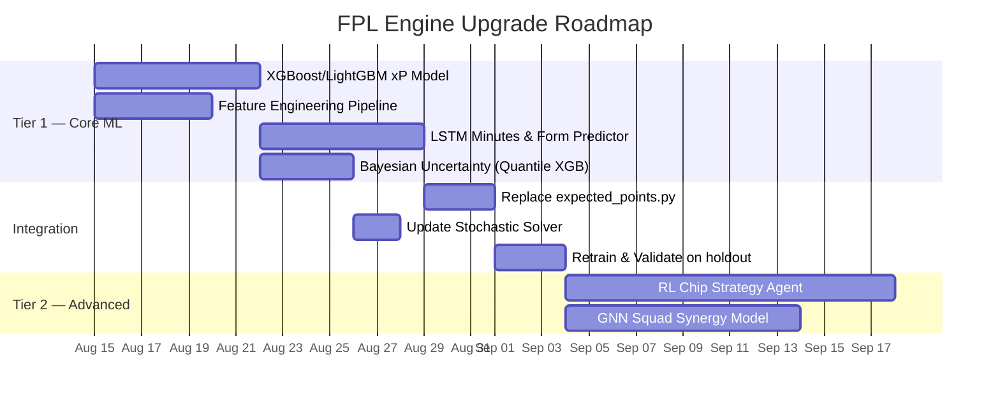
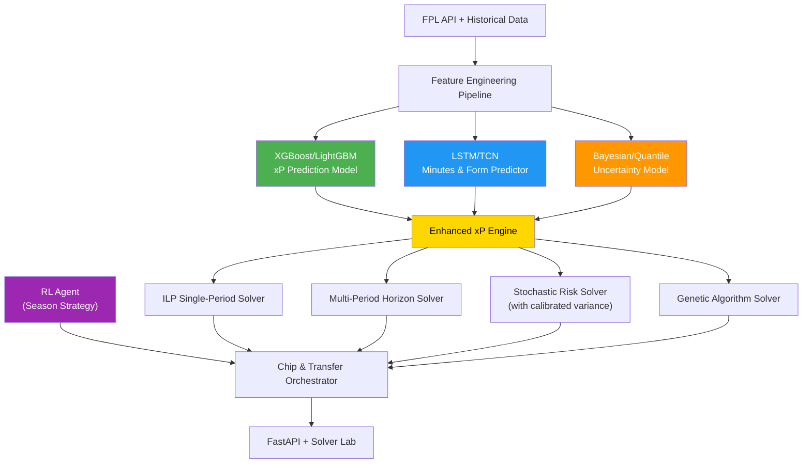

# FPL Recommendation Engine — Improvement Analysis & SOTA Model Recommendations

## Current State Assessment

Your engine is already well-structured with a layered architecture: **FPL API Client → xP Engine → Solvers (ILP, Stochastic, Genetic, Multi-Period) → FastAPI**. The codebase is cleanly typed with Pydantic, supports CUDA GPU acceleration, and has 5 seasons of historical data from [vaastav's dataset](https://github.com/vaastav/Fantasy-Premier-League).

### What Works Well ✅
| Component | Strength |
| :--- | :--- |
| **ILP Solver** (PuLP/CBC) | Globally optimal squad selection under constraints — this is the gold standard for the "knapsack" problem |
| **Genetic Algorithm** | Well-implemented memetic GA with smart seeding, position-guided crossover, Jaccard diversity control, GPU batch fitness |
| **Multi-Period Horizon** | Transfer-aware planning with hit cost, bank balance, and free transfer rollover modeling |
| **Monte Carlo Stochastic** | GPU-accelerated scenario sampling for risk-adjusted utility |
| **Architecture** | Clean separation of concerns, strong typing, async data pipeline |

---

### Where the Gaps Are 🔴

The biggest weakness is **how you predict xP itself**. Every solver downstream (ILP, genetic, stochastic, horizon) is only as good as the xP estimates they optimize over, and your current [expected_points.py](file:///d:/repos/fpl/src/fpl/optimizer/expected_points.py) is entirely **hand-tuned heuristic rules**, not learned from data:

| Gap | Current Approach | Problem |
| :--- | :--- | :--- |
| **xP Prediction** | Manual formulas with hard-coded thresholds (e.g., `cs_prob = 0.35 if DEF`) | No data-driven learning; doesn't adapt to player/team context |
| **Minutes Prediction** | Simple avg-minutes with fixed floors | Doesn't model rotation risk, manager tendencies, or fixture congestion |
| **Bonus Points** | `(ict_index / 100) * 0.4` | Linear approximation ignores BPS component interactions |
| **Form Dynamics** | `form` field used as static float | No temporal modeling of streaks, regression to mean, or momentum |
| **Injury/Availability** | Not modeled at all | Massive source of prediction error in FPL |
| **Opponent Strength** | 5-level FDR lookup table | Crude; doesn't capture team-specific attacking/defensive profiles |
| **Uncertainty** | Monte Carlo adds noise to point estimates | Doesn't model true aleatory uncertainty per player |
| **Chip/Transfer Strategy** | ILP over multi-period block | Myopic — no season-long strategic planning |

---

## State-of-the-Art Models to Integrate

### Tier 1 — Highest Impact, Most Practical

#### 1. 🌟 XGBoost / LightGBM Ensemble for xP Prediction

**Replace** your hand-tuned [expected_points.py](file:///d:/repos/fpl/src/fpl/optimizer/expected_points.py) formulas with a **gradient-boosted decision tree** trained on your 5 seasons of historical data.

```
Why:  XGBoost/LightGBM are the industry standard for tabular player
      performance prediction. They consistently beat neural networks
      on structured FPL-style data and natively handle missing values,
      non-linear feature interactions, and categorical features.

Data: You already have it — vaastav's merged_gw.csv across 5 seasons
      in data/historical/ contains gameweek-level actuals for every
      player (points, goals, assists, minutes, BPS, xG, xA, etc.)

Features:
  ├── Player: rolling xG/90, xA/90, BPS, ICT, minutes %, form trend
  ├── Team:   team strength (attack/defense ratings), fixture congestion
  ├── Fixture: opponent defensive quality, home/away, FDR
  ├── Meta:    price, ownership %, position, season phase
  └── Lag:     1-GW, 3-GW, 5-GW rolling averages of all above

Target: next-GW total_points (regression)

Libraries: xgboost, lightgbm (both pip-installable, no CUDA required)
```

> [!IMPORTANT]
> This single change would have the **largest impact** on recommendation quality. Your solvers are sophisticated — they deserve better input signal.

---

#### 2. 🧠 LSTM / Temporal Convolutional Network for Form & Minutes

Add a **sequence model** that ingests rolling player history to predict:
- **P(starts)** — probability of starting (vs. benched/rested)
- **E[minutes]** — expected minutes conditional on starting
- **Form trajectory** — is the player trending up, plateauing, or declining?

```
Architecture:
  Input:  Sliding window of last N gameweeks (N=6-10)
          Each timestep: [minutes, points, xG, xA, BPS, was_home, FDR, ...]
  Model:  2-layer LSTM → Dense → [P(start), E[mins], form_score]
  
  Alternative: 1D Temporal Convolutional Network (TCN)
               - Faster training, no vanishing gradients
               - Works better with shorter sequences

Library: PyTorch (you already have it for GPU acceleration)
```

> [!TIP]
> The LSTM output feeds directly into your xP engine as better `expected_minutes` and `form` inputs, even if you keep the rest of the xP formula unchanged. This is a modular upgrade.

---

#### 3. 📊 Bayesian Hierarchical Model for Uncertainty Quantification

Replace your Monte Carlo "add Gaussian noise" approach with a **proper Bayesian model** that outputs **posterior distributions** rather than point estimates.

```
What it does:
  Instead of:  "Haaland will score 8.5 xP"
  You get:     "Haaland: mean=8.5, 90% CI=[5.2, 12.1], P(haul>10)=0.28"

Why it matters:
  - Captaincy decisions should maximize E[2x * points], not just E[points]
  - Bench ordering should account for boom/bust profiles
  - Your stochastic solver currently manufactures variance from noise —
    a Bayesian model gives you *calibrated* variance from data

Implementation:
  - PyMC (Python) for MCMC posterior sampling
  - Or: Quantile Regression with XGBoost (predict 10th, 50th, 90th percentile)
    — much simpler, nearly as useful

Library: pymc or xgboost (quantile objective)
```

---

### Tier 2 — Advanced, Higher Effort

#### 4. 🤖 Reinforcement Learning Agent for Season-Long Chip & Transfer Strategy

Your multi-period horizon solver optimizes a fixed N-gameweek block, but it doesn't handle **season-long sequential decisions** like:
- *When* to play Bench Boost vs. Triple Captain vs. Free Hit
- Banking free transfers vs. using them early
- Timing a Wildcard around fixture swings

```
Framework:
  State:   current squad, bank, free transfers, chips remaining,
           upcoming fixture difficulty, GW number
  Action:  {make N transfers, play chip X, hold}
  Reward:  GW points - hit penalties
  
  Algorithm: PPO (Proximal Policy Optimization) or DQN
  Training:  Simulate 10,000+ seasons using your xP model as the 
             "environment" reward function

Library: stable-baselines3 (PyTorch-based)
```

---

#### 5. 🔗 Graph Neural Network (GNN) for Team Interaction Effects

Model **player synergies and anti-synergies** that your current per-player xP model misses entirely:
- Two attackers from the same team competing for the same goals
- A creative midfielder boosting his striker's xA
- Team defensive quality affecting all defenders' clean sheet probability

```
Architecture:
  Nodes:  Players in a squad
  Edges:  Same-team links, position adjacency, historical correlation
  Model:  Graph Attention Network (GAT) → squad-level xP adjustment

Library: PyTorch Geometric
```

---

#### 6. 📰 NLP Press Conference & Injury Sentinel

Scrape and analyze manager press conferences and injury reports to predict:
- Rotation likelihood ("We have a big game on Wednesday")
- Return-from-injury timing
- New signing integration

```
Approach:  Fine-tuned BERT/DistilBERT classifier on labeled press 
           conference snippets → P(rotated), P(fit), P(starts)

Data:      premierleague.com press conferences, Twitter/X injury updates
Library:   transformers (HuggingFace)
```

---

## Recommended Implementation Roadmap



---

## Impact vs. Effort Matrix

| Model | Impact on xP Accuracy | Implementation Effort | Dependencies |
| :--- | :---: | :---: | :--- |
| **XGBoost/LightGBM Ensemble** | ⭐⭐⭐⭐⭐ | 🔧🔧 Low | `xgboost`, `lightgbm` |
| **LSTM/TCN Form Predictor** | ⭐⭐⭐⭐ | 🔧🔧🔧 Medium | `torch` (already installed) |
| **Bayesian Quantile Regression** | ⭐⭐⭐⭐ | 🔧🔧 Low | `xgboost` or `pymc` |
| **RL Chip/Transfer Agent** | ⭐⭐⭐ | 🔧🔧🔧🔧 High | `stable-baselines3` |
| **GNN Squad Synergies** | ⭐⭐ | 🔧🔧🔧🔧 High | `torch-geometric` |
| **NLP Injury Sentinel** | ⭐⭐⭐ | 🔧🔧🔧🔧🔧 Very High | `transformers`, scraping infra |

---

## Proposed New Architecture



## What to Improve in the README

Beyond the modeling upgrades, the README itself could benefit from:

1. **Architecture diagram** — A visual Mermaid diagram showing the data flow (API → DB → xP Engine → Solvers → API) would make the README far more engaging
2. **Benchmark / Results section** — Show how your solver performs against a baseline (e.g., "top 1% of FPL managers" or "beat official ep_next by X%")
3. **Model card** — Document what your xP engine actually models and what it *doesn't* (injury risk, set-piece takers, etc.)
4. **Contributing guide** — If open-source, a `CONTRIBUTING.md` would help
5. **Badges for coverage** — Add a test coverage badge alongside your existing ones
6. **Demo GIF/screenshot** — A visual of the Solver Lab or CLI output would make the project much more approachable
